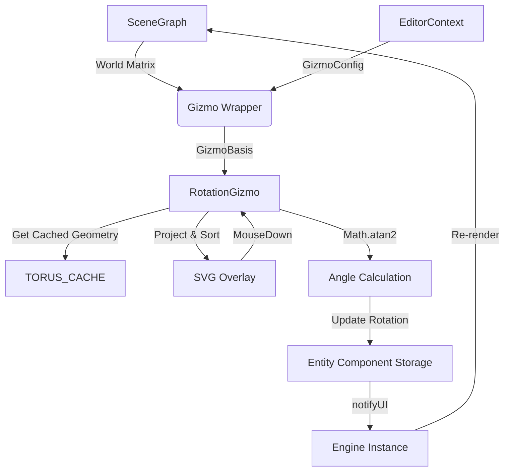

# Rotation Gizmo Architecture

## Overview
The `RotationGizmo` facilitates precise 3D rotation of entities. It visualizes three orthogonal rings (X, Y, Z) corresponding to the entity's local axes, along with an optional screen-space ring for view-aligned rotation. 

Like the Translation Gizmo, it employs a hybrid rendering strategy: mathematically generating 3D geometry (Torus, Rhombus decorations) and projecting it into a 2D SVG overlay. This ensures crisp, resolution-independent lines while maintaining correct 3D depth sorting and shading.

## Architecture & Module Interaction

### 1. Component Hierarchy
* **`SceneView`** (Container)
    * Provides the View-Projection Matrix (`vpMatrix`) and viewport dimensions.
* **`Gizmo`** (Switcher)
    * Calculates the `GizmoBasis` (Origin, Axes, Scale).
    * Instantiates `RotationGizmo` when the tool is set to `'ROTATE'`.
* **`RotationGizmo`** (Implementation)
    * **Geometry Generation**: Generates vertices for Torus shapes on the fly or retrieves them from `TORUS_CACHE`.
    * **Rendering**: Uses `renderVolumetricMesh` to project 3D faces to 2D polygons, applying depth sorting (Painter's Algorithm) and simple lighting.
    * **Interaction**: Handles circular mouse movements to apply delta rotation to the ECS components.

### 2. Data Flow Diagram



## Key Data Structures

### DragState
The rotation gizmo maintains specific state during a drag operation:
```typescript
{
    axis: Axis;             // 'X' | 'Y' | 'Z' | 'VIEW'
    startRotation: Vector3; // Euler angles at drag start
    startAngle: number;     // Mouse angle (atan2) at drag start
    currentAngle: number;   // Current delta angle
    axisVector: Vector3;    // Normal vector of the rotation plane
    u: Vector3;             // Basis vector 1 for the plane
    v: Vector3;             // Basis vector 2 for the plane
}
```

### Geometry Cache
To avoid recalculating complex torus geometry every frame:
* **`TORUS_CACHE`**: A Map storing `{ vertices, indices }` keyed by `radius-thickness`.
* **`RHOMBUS_CACHE`**: Stores geometry for the decorative elements on the rings.

## Interaction Logic

### 1. Circular Dragging
Unlike translation which uses linear projection, rotation relies on polar coordinates relative to the gizmo's screen center.

1. **Center Calculation**: Project the 3D origin to 2D screen coordinates (`pCenter`).
2. **Angle Calculation**: On mouse move, calculate `Math.atan2(mouseY - pCenter.y, mouseX - pCenter.x)`.
3. **Delta**: `currentAngle - startAngle`.
4. **View Correction**: If the axis points away from the camera, the rotation direction is inverted to match user intuition (Clockwise vs Counter-Clockwise).

### 2. Snapping
Holding `Shift` enables snapping. The delta is rounded to the nearest 15 degrees (π/12 radians).

```typescript
if (e.shiftKey) {
    const snap = Math.PI / 12;
    delta = Math.round(delta / snap) * snap;
}
```

### 3. Visual Feedback
* **Pie Sector**: A semi-transparent polygon is drawn from the start angle to the current angle to visualize the magnitude of rotation.
* **Text Label**: A floating label displays the current delta in degrees (e.g., `45°`).

## Customization (GizmoConfig)

Developers can customize the look and feel via `EditorContext` or the Preferences Modal.

| Property | Description | Default |
| :--- | :--- | :--- |
| **`rotationRingSize`** | Base radius of the X, Y, Z rings relative to gizmo scale. | `1.2` |
| **`rotationRingTubeScale`** | Multiplier for the thickness of the ring tube. | `1.0` |
| **`rotationScreenRingScale`** | Scale multiplier for the outer white ring (VIEW axis). | `1.25` |
| **`rotationShowScreenRing`** | Boolean to show/hide the outer view-aligned ring. | `true` |
| **`rotationShowDecorations`**| Boolean to show small rhombuses/ticks on the rings. | `true` |
| **`rotationShowSector`** | Boolean to show the pie-chart visualization during drag. | `true` |

### Styling
Colors are defined in `GIZMO_COLORS` but can be overridden via config:
* `axisHoverColor`: Color when hovering over a ring.
* `axisPressColor`: Color when dragging a ring.
* Standard Axes: X (Red), Y (Green), Z (Blue).
